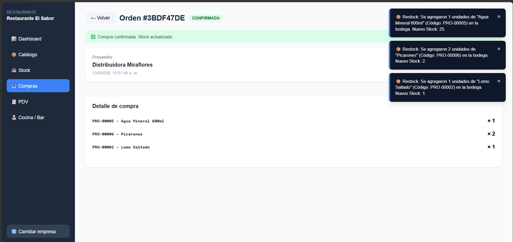
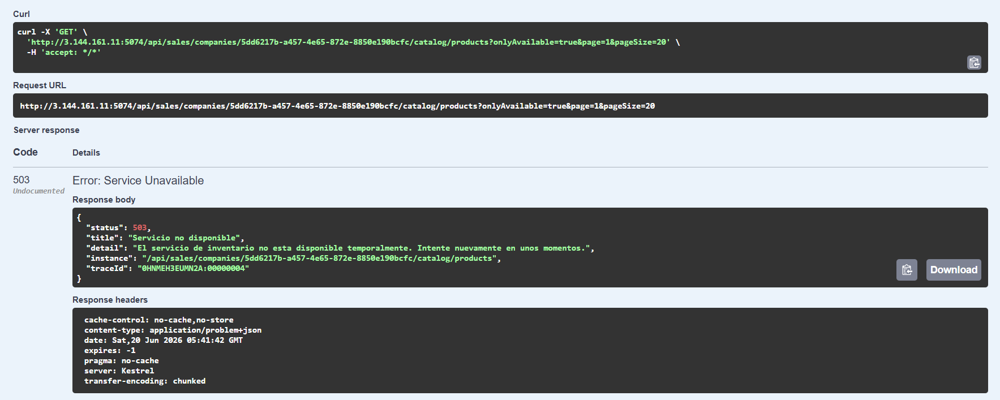
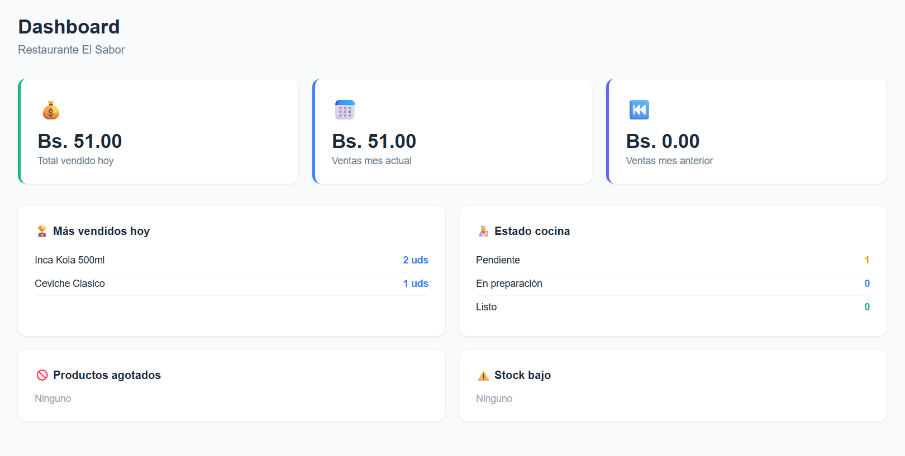

# Reporte Previo — Estructura del EXAMEN_FINAL.md

Entrega individual antes del examen. Cada estudiante documenta su propio módulo. Los 3 casos deben estar documentados independientemente del caso que les toque el día de la defensa. Si no hay snippets, esa subsección es 0 — no se busca el código el día del examen.

> El examen requiere que los 3 módulos del trío estén desplegados en AWS y comunicándose. Esta entrega cubre solo el tuyo.

> Los nombres de archivos, clases y métodos indicados en cada sección son referenciales. Usar la ruta y nombre real del proyecto propio.

---

## Estructura requerida

### Sección 1 — Despliegue en AWS

**1.1 URLs en producción**
- Mi módulo: `http://3.144.161.11:5074/`
- Mi módulo (Swagger): `http://3.144.161.11:5074/swagger/index.html`
- Belen (módulo compras): `http://54.89.193.126:5085/swagger#/`
- Henrry (módulo inventario): `http://3.80.84.228:5143`

**1.2 Variables de entorno (.env.example)**
```ini
DB_USER=admin
DB_PASSWORD=secret_password
DB_NAME=fastinventorydb

ASPNETCORE_ENVIRONMENT=Development

DB_CONNECTION_STRING=Host=postgres-db;Database=fastinventorydb;Username=admin;Password=secret_password

# MODO DE EJECUCIÓN (Development / Production)

# INTEGRACIÓN DINÁMICA
# Opción A: Usar mi propio Inventario (Docker)
INVENTORY_API_URL=http://inventory-api:8080

# Opción B: Usar el Inventario de un compañero (Ejemplo)
# INVENTORY_API_URL=http://54.1.2.3:5143

# URLs para el Frontend (Web App)
VITE_INVENTORY_API_URL=http://localhost:5143
VITE_PURCHASES_API_URL=http://localhost:5085
VITE_SALES_API_URL=http://localhost:5074

```

**1.3 Cómo simular caída de Inventario**
```bash
# Para simular la caída del servicio de Inventario, detén el contenedor de la API de inventario en el servidor de AWS:
docker compose stop inventory-api

# Para restablecer el servicio, vuelve a iniciar el contenedor:
docker compose start inventory-api
```

---

### Sección 2 — Notificación de restock (SSE)

**2.1 Endpoint SSE en Inventario**
`Src/Controllers/InventarioController.cs` · método `StreamRestockEvents` (en `Inventory.Api/Controllers/RestockEventsController.cs`)
```csharp
[HttpGet]
public async Task Stream(string companyCen, CancellationToken ct)
{
    Response.Headers.Append("Content-Type", "text/event-stream");
    Response.Headers.Append("Cache-Control", "no-cache");
    Response.Headers.Append("Connection", "keep-alive");

    var clientChannel = Channel.CreateUnbounded<RestockEvent>();
    var subscriptionId = broadcaster.Subscribe(companyCen, clientChannel);

    try
    {
        while (!ct.IsCancellationRequested)
        {
            using var delayTokenSource = CancellationTokenSource.CreateLinkedTokenSource(ct);
            var delayTask = Task.Delay(15000, delayTokenSource.Token);
            var readTask = clientChannel.Reader.WaitToReadAsync(ct).AsTask();

            var completedTask = await Task.WhenAny(readTask, delayTask);
            if (completedTask == readTask)
            {
                delayTokenSource.Cancel();
                if (await readTask)
                {
                    while (clientChannel.Reader.TryRead(out var evento))
                    {
                        var json = JsonSerializer.Serialize(evento, new JsonSerializerOptions { PropertyNamingPolicy = JsonNamingPolicy.CamelCase });
                        await Response.WriteAsync($"data: {json}\n\n", ct);
                        await Response.Body.FlushAsync(ct);
                    }
                }
            }
            else
            {
                await Response.WriteAsync($": keep-alive\n\n", ct);
                await Response.Body.FlushAsync(ct);
            }
        }
    }
    finally
    {
        broadcaster.Unsubscribe(subscriptionId);
    }
}
```

**2.2 Canal en memoria (registro en DI)**
`Program.cs` · registro del `Channel<RestockEvent>` como singleton (en `Inventory.Api/Program.cs`)
```csharp
builder.Services.AddSingleton<Inventory.Api.Infrastructure.RestockEventBroadcaster>();
```

**2.3 Consumidor en Ventas (frontend)**
`src/components/Layout.tsx` (consumo de `EventSource` y manejo de eventos SSE)
```typescript
let inventoryUrl = import.meta.env.VITE_INVENTORY_API_URL || 'http://localhost:5143';
if (inventoryUrl.endsWith('/')) {
  inventoryUrl = inventoryUrl.slice(0, -1);
}
const sseUrl = inventoryUrl.endsWith('/api/inventory')
  ? `${inventoryUrl}/companies/${companyCen}/restock-events`
  : `${inventoryUrl}/api/inventory/companies/${companyCen}/restock-events`;
  
const source = new EventSource(sseUrl);

source.onmessage = (event) => {
  try {
    const restock = JSON.parse(event.data);
    const id = Math.random().toString(36).substring(2, 9);
    const msg = `📦 Restock: Se agregaron ${restock.quantity} unidades de "${restock.productName}" (Código: ${restock.productCode}) en la bodega. Nuevo Stock: ${restock.newStock}.`;
    
    setAlerts(prev => [...prev, { id, message: msg }]);
    
    setTimeout(() => {
      setAlerts(prev => prev.filter(a => a.id !== id));
    }, 6000);
  } catch (err) {
    console.error("Error parsing restock event", err);
  }
};
```

**2.4 Captura: notificación visible en Ventas**


---

### Sección 3 — Resiliencia con Polly

**3.1 Política implementada**
`Sales.Api/Program.cs` (registro de HttpClient con políticas de Retry y Circuit Breaker de Polly)
```csharp
var retryPolicy = HttpPolicyExtensions
    .HandleTransientHttpError()
    .WaitAndRetryAsync(3, retryAttempt => TimeSpan.FromSeconds(Math.Pow(2, retryAttempt)));

var circuitBreakerPolicy = HttpPolicyExtensions
    .HandleTransientHttpError()
    .CircuitBreakerAsync(5, TimeSpan.FromSeconds(30));

builder.Services.AddHttpClient<IInventoryCatalogClient, InventoryCatalogClient>(client =>
{
    client.BaseAddress = new Uri(inventoryBaseUrl);
})
.AddPolicyHandler(retryPolicy)
.AddPolicyHandler(circuitBreakerPolicy);
```

**3.2 Dónde se aplica**
`Sales.Api/Controllers/CatalogController.cs` · método donde se llama a `IInventoryCatalogClient`
```csharp
[HttpGet("products")]
public async Task<IActionResult> GetProducts(
    string companyCen,
    [FromQuery] string? search,
    [FromQuery] string? categoryCen,
    [FromQuery] string? warehouseCen,
    [FromQuery] bool onlyAvailable = true,
    [FromQuery] int page = 1,
    [FromQuery] int pageSize = 20,
    CancellationToken cancellationToken = default)
{
    var products = await inventoryClient.GetSellableProductsAsync(companyCen, search, categoryCen, warehouseCen, onlyAvailable, page, pageSize, cancellationToken);
    return products is null ? StatusCode(502, "Inventory API did not return catalog data.") : Ok(products);
}
```

**3.3 Respuesta cuando Inventario no responde**
```json
{
  "status": 503,
  "title": "Servicio no disponible",
  "detail": "El servicio de inventario no esta disponible temporalmente. Intente nuevamente en unos momentos.",
  "instance": "/api/sales/companies/EMP-00001/catalog/products",
  "traceId": "0HN12345678"
}
```

**3.4 Captura: comportamiento con Inventario caído**


---

### Sección 4 — Historial y dashboard

**4.1 Modelo de la tabla de ventas**
`Sales.Api/Domain/Entities/TicketItem.cs` · entidad de detalle del ticket que almacena el `UnitPrice` histórico de la venta
```csharp
public sealed class TicketItem
{
    public int Id { get; set; }
    public Guid Cen { get; set; } = Guid.NewGuid();
    public int TicketId { get; set; }
    public Guid TicketCen { get; set; }
    public int ProductId { get; set; }
    public Guid ProductCen { get; set; }
    public decimal Quantity { get; set; } = 1;
    public decimal UnitPrice { get; set; }
    public string Status { get; set; } = "PENDING";
    public string? Notes { get; set; }
}
```

**4.2 Cómo se guarda el precio en la transacción**
`Sales.Api/Controllers/TicketsController.cs` · método `AddItem` donde se guarda el precio unitario del producto en la transacción
```csharp
var item = new TicketItem
{
    TicketId = ticket.Id,
    TicketCen = ticket.Cen,
    ProductCen = productCen,
    Quantity = quantity,
    UnitPrice = request.UnitPrice,
    Notes = request.Notes,
    Status = "PENDING"
};

Db.TicketItems.Add(item);
await Db.SaveChangesAsync();
```

**4.3 Query del dashboard mensual**
`Sales.Api/Controllers/DashboardController.cs` · método `MonthlySales` para consultar ventas del mes actual y mes anterior
```csharp
var now = DateTime.UtcNow;
var startOfCurrentMonth = new DateTime(now.Year, now.Month, 1, 0, 0, 0, DateTimeKind.Utc);
var endOfCurrentMonth = startOfCurrentMonth.AddMonths(1).AddTicks(-1);

var startOfPreviousMonth = startOfCurrentMonth.AddMonths(-1);
var endOfPreviousMonth = startOfCurrentMonth.AddTicks(-1);

var currentMonthTotal = await Db.Payments
    .Where(x => Db.Tickets.Any(t => t.Id == x.TicketId && t.CompanyCen == company.Cen) && x.CreatedAt >= startOfCurrentMonth && x.CreatedAt <= endOfCurrentMonth)
    .SumAsync(x => (decimal?)x.Amount) ?? 0;

var previousMonthTotal = await Db.Payments
    .Where(x => Db.Tickets.Any(t => t.Id == x.TicketId && t.CompanyCen == company.Cen) && x.CreatedAt >= startOfPreviousMonth && x.CreatedAt <= endOfPreviousMonth)
    .SumAsync(x => (decimal?)x.Amount) ?? 0;
```

**4.4 Captura: dashboard mes actual vs. mes anterior**


---

### Sección 5 — Swagger y Contrato API

> El `contrato-api.yaml` se entrega por separado en Moodle como tarea propia.
> Debe cubrir los 3 módulos (Inventario, Ventas, Compras) e incluir los endpoints
> de integración: SSE restock, stock consume, stock increase y recepción de compras.

URL del Swagger de cada módulo del trío:

| Módulo | URL Swagger |
|---|---|
| Mi módulo (Ventas) | `http://3.144.161.11:5074/swagger/index.html` |
| Belen (Compras) | `http://54.89.193.126:5085/swagger#/` |
| Henrry (Inventario) | `http://3.80.84.228:5143/swagger/index.html` |
