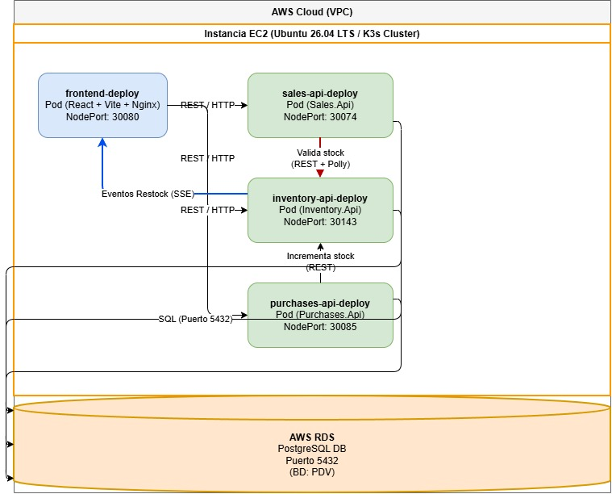

# Guía Maestra de Arquitectura, Decisiones Técnicas y Preparación para la Defensa Oral

Este documento recopila toda la información técnica necesaria para cumplir con la rúbrica de evaluación excelente del proyecto. Está estructurado como una guía de estudio de defensa individual y contiene el diseño físico en AWS, la justificación detallada de decisiones y el diagrama arquitectónico listo para ser importado en **draw.io** (diagrams.net).

---

## 1. Topología Física y Arquitectura en la Nube (AWS)

El sistema se diseñó siguiendo el principio de **desacoplamiento de infraestructura** y **seguridad de red**:

*   **Instancia EC2 (Capa de Cómputo):** Se utiliza una instancia EC2 ejecutando Ubuntu para alojar un clúster ligero de Kubernetes (**K3s**). Esta capa gestiona los microservicios del negocio de manera redundante mediante Pods, permitiendo el escalado automático horizontal (HPA) según la carga de trabajo.
*   **Base de Datos Desacoplada (AWS RDS):** Para cumplir con los estándares de seguridad empresariales, la base de datos PostgreSQL se ejecuta de manera independiente en un servicio administrado **AWS RDS (Relational Database Service)**. Esto separa completamente la persistencia de datos del ciclo de vida de los contenedores y de la máquina de cómputo EC2.
*   **Seguridad de Red (VPC & Security Groups):** 
    *   La base de datos RDS se encuentra protegida dentro de la VPC y no está expuesta públicamente al exterior.
    *   Se configuró una regla de entrada en el grupo de seguridad de la base de datos (`default (sg-04a5d9966c9a0d5b4)`) que permite tráfico en el puerto `5432` únicamente desde el grupo de seguridad de la instancia EC2 (`launch-wizard-2 (sg-0e1f8b9ff24b2bf0d)`).
    *   Los microservicios backend se comunican de forma privada dentro de la red interna de Kubernetes (`ClusterIP`), mientras que el Frontend se expone al exterior mediante un puerto NodePort (`30080`) en la dirección IP pública del servidor EC2.

---

## 2. Decisiones Arquitectónicas Justificadas (ADRs)

### ADR-001: Tiempo Real con Server-Sent Events (SSE) frente a WebSockets
*   **Justificación:** El reabastecimiento de existencias (*restock*) requiere una comunicación **unidireccional** (del servidor al cliente: el backend de inventario notifica al navegador del cajero). WebSockets está diseñado para comunicación bidireccional de baja latencia (como un chat), lo cual añade sobrecarga de red y complejidad innecesaria.
*   **Beneficios de SSE:**
    *   **Protocolo tradicional:** Corre sobre HTTP/HTTPS estándar (puertos 80/443), atravesando firewalls y proxies corporativos sin configuraciones especiales.
    *   **Resiliencia nativa:** El navegador reconecta automáticamente de forma nativa ante pérdidas de señal de red.
    *   **Implementación ligera:** Utiliza canales en memoria concurrentes (`System.Threading.Channels`) en el backend sin necesidad de un servidor de mensajería complejo.

### ADR-002: Resiliencia con Polly (Retry Exponencial y Circuit Breaker)
*   **Justificación:** En una arquitectura distribuida, la red es inestable. Si `Sales.Api` no puede comunicarse con `Inventory.Api` para verificar stock, el sistema fallaría en cascada bloqueando el punto de venta.
*   **Estrategia:**
    *   **Retry Exponencial:** Ante fallas transitorias, Polly realiza hasta **3 reintentos** con esperas que aumentan de forma exponencial ($2s$, $4s$, $8s$), dando tiempo a que el servicio destino se estabilice.
    *   **Circuit Breaker (Disyuntor):** Si se registran **5 fallos consecutivos**, el circuito se "abre" por **30 segundos**. Durante este tiempo, cualquier intento de llamada se cancela instantáneamente a nivel local (falla rápido), devolviendo un error **503 Service Unavailable** estandarizado en formato RFC 7807 (`ProblemDetails`). Esto protege los hilos de ejecución de la API de ventas de quedar bloqueados y permite que la API de inventario se recupere sin recibir avalanchas de tráfico.

---

## 3. Runbook Operacional y Guía de Despliegue

### Paso 1: Configurar los Secretos de Base de Datos en K8s
Las credenciales de base de datos no se suben al código. Se inyectan en Kubernetes ejecutando en la terminal de tu EC2:
```bash
# Eliminar secretos viejos
kubectl delete secret inventory-api-secrets sales-api-secrets purchases-api-secrets

# Crear nuevos secretos con la cadena de conexión completa
kubectl create secret generic inventory-api-secrets \
  --from-literal=DB_CONNECTION_STRING='Host=pdv-database.cdu282qysmbo.us-east-2.rds.amazonaws.com;Port=5432;Database=PDV;Username=postgres;Password=TU_CONTRASEÑA'

kubectl create secret generic sales-api-secrets \
  --from-literal=DB_CONNECTION_STRING='Host=pdv-database.cdu282qysmbo.us-east-2.rds.amazonaws.com;Port=5432;Database=PDV;Username=postgres;Password=TU_CONTRASEÑA'

kubectl create secret generic purchases-api-secrets \
  --from-literal=DB_CONNECTION_STRING='Host=pdv-database.cdu282qysmbo.us-east-2.rds.amazonaws.com;Port=5432;Database=PDV;Username=postgres;Password=TU_CONTRASEÑA'
```

### Paso 2: Inicializar el Esquema de Base de Datos (Migraciones)
Ejecuta esto en la terminal del EC2 para aplicar los cambios sobre la base de datos de AWS RDS:
```bash
# 1. Instalar la herramienta EF
dotnet tool install --global dotnet-ef
export PATH="$PATH:$HOME/.dotnet/tools"

# 2. Restaurar dependencias
dotnet restore InventorySystem.sln

# 3. Aplicar migraciones
dotnet ef database update -p Inventory.Api/Inventory.Api.csproj -c InventoryDbContext
dotnet ef database update -p Sales.Api/Sales.Api.csproj -c SalesDbContext
dotnet ef database update -p Purchases.Api/Purchases.Api.csproj -c PurchasesDbContext
```

### Paso 3: Lanzar la Aplicación en el Clúster
Aplica los manifiestos de Kubernetes y despliega los pods:
```bash
kubectl apply -f k8s/
```

---

## 4. Guía de Estudio para la Defensa Oral (Preguntas Clave)

### P1: ¿Por qué tuviste errores del tipo `CrashLoopBackOff` al inicio y cómo los solucionaste?
*   **Respuesta:** Ocurrió porque las sondas de salud (`Liveness` y `Readiness` Probes) estaban configuradas para validar la salud a través de la ruta `/swagger/index.html`. En ASP.NET Core, Swagger se deshabilita en producción por defecto. Al correr en `Production`, la API devolvía un código `404 Not Found` en la sonda. Kubernetes asumía que el contenedor estaba roto y lo reiniciaba constantemente. Lo solucionamos inyectando la variable de entorno `ASPNETCORE_ENVIRONMENT=Development` en los manifiestos de Kubernetes para forzar la inicialización de Swagger.

### P2: ¿Por qué la aplicación devolvía un error `400 Bad Request` en producción si pasaba los test unitarios?
*   **Respuesta:** En el código original se realizaban llamadas a `.ToString()` sobre campos de tipo `Guid` (como `Cen.ToString()`) dentro de las expresiones `.Select()` de las consultas LINQ. En los test unitarios se utilizaba una base de datos en memoria (`InMemory Database`) que soporta la evaluación del lado del cliente sin problemas. Sin embargo, en producción con PostgreSQL real, la librería `Npgsql` no puede traducir `Guid.ToString()` a lenguaje SQL de PostgreSQL, lanzando un fallo de traducción de consulta. Lo solucionamos separando la consulta (extrayendo los datos de la base de datos primero) y aplicando la conversión `.ToString()` en memoria del lado del servidor.

### P3: ¿Cómo logras que el frontend cargado en el navegador de un cliente llame a las APIs correctas si la IP del servidor cambia?
*   **Respuesta:** El frontend React es una SPA (Single Page Application) que se compila a código estático HTML/JS y se descarga en el navegador del cliente. No podemos usar variables de entorno del servidor en tiempo de ejecución. Lo solucionamos implementando una resolución dinámica de URLs de API en el archivo `axios.ts`: el código detecta mediante Javascript el host actual del navegador (`window.location.hostname`) y, si está en el puerto `30080` (NodePort), redirige de forma transparente las llamadas hacia los puertos NodePort expuestos del backend (Ventas: `30074`, Inventario: `30143`, Compras: `30085`) bajo esa misma IP.

---

## 5. Diagrama de Arquitectura Física (XML para Draw.io)
